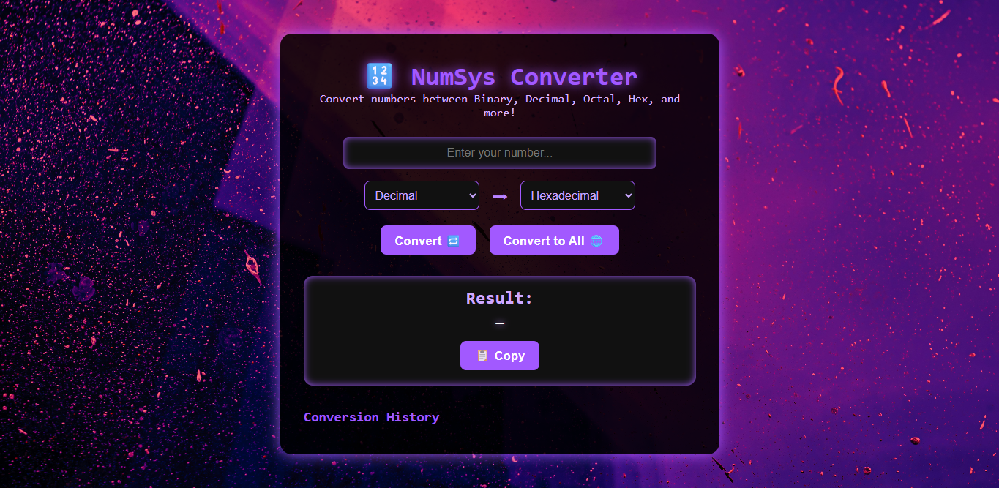

# 🔢 NumSys Converter

  
  
  

A sleek and interactive **web app** that converts numbers between **Binary, Decimal, Octal, Hexadecimal, 1’s Complement, 2’s Complement, and NAF**. Features include conversion history, copy-to-clipboard, and a futuristic tech-inspired interface.

---

## 🌟 Live Demo & Slides

- **Live App:** [View Here](https://num-system-converter.vercel.app/)  
- **Project Slides:** [View Slides](https://gamma.app/docs/NumSys-Converter-n8mro9e6ml5f11v)  

---

## 🛠 Features

- Convert between all supported number systems.  
- **Convert to All:** Display all equivalents at once.  
- Copy results to clipboard with a button.  
- Maintain a conversion history log.  
- Accessible UI with `aria-labels`.  
- Futuristic dark theme with purple neon glow.  
- Fully responsive design for all screen sizes.  

---

## 💻 Tech Stack

- **HTML5** – Semantic structure of the app  
- **CSS3** – Neon-futuristic styling, responsive layout  
- **JavaScript** – Conversion logic, interactive UI, clipboard & history  

---

## 🚀 How to Use

1. Clone this repository:

git clone https://github.com/vickie005/NumSystemConverter.git
Open index.html in your preferred browser.

Enter a number in the input field.

Select From and To number systems from the dropdowns.

Click Convert 🔁 to get a single result or Convert to All 🌐 for all conversions.

Use the Copy 📋 button to copy the result.

## 📸 Screenshot

## 📂 Project Structure

NumSys-Converter/
│
├─ index.html
├─ style.css
├─ script.js
└─ assets/
   ├─ background.jpg
   └─ screenshot.png
